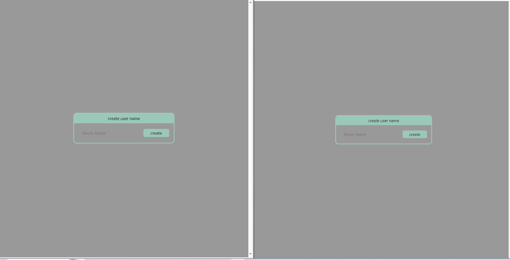

# vue-nest-chat

  
  

<!--

  

-->

[circleci-image]: https://img.shields.io/circleci/build/github/nestjs/nest/master?token=abc123def456
[circleci-url]: https://circleci.com/gh/nestjs/nest

# 주요기능

socketio를 이용한 간단한 채팅앱 vue + nestjs 로 만듬 
websocket에 대해 공부를 하다가 Node.js맞춤형 버전인 socket.io를 공부할 목적으로 만듬 
찾아보니까 socketio대부분을 express.js로만 하던데 암만 찾아봐도 Nestjs로 만든곳을 찾기 힘들어서 한번 찾아가면서 만들어봤다 국내는 거의 없더라  
주 기능  

- 오픈 채팅방 만듬 유저가 들어가기
- 실시간으로 방목록 초기화 http로 갱신가능
- 닉네임기능
- socket auth기능 토큰사용 => fake token
- 서버쪽에 test코드 만듬 (진행중) 

----- 

즉흥적으로 시작한것도 있고 간단하게 만들 예정이였어서 DB연결도 안했고 token발행 코드도 없다 

중간에 REDIS Stream코드가 있는데 socket이랑 비슷한 기능인가? 싶어서 연결해봤다 내가 생각한 기능은 아니여서 주기능에서 제외함 

---- 

Redis Stream의 주요 특징 및 WebSocket과의 차이점

1. 이벤트 스트림: Redis Stream은 이벤트 스트림을 저장하고 처리하기 위한 자료구조로 설계되었습니다. 이벤트 스트림은 실시간으로 발생하는 이벤트를 처리하는 데 사용됩니다.

2. 다양한 데이터 타입: Redis Stream은 다양한 데이터 타입을 지원하며, 이벤트 데이터를 JSON, 문자열 또는 바이너리 데이터 등 다양한 형식으로 저장할 수 있습니다.

3. 소비자 그룹: Redis Stream은 여러 소비자 그룹을 지원하여 다수의 애플리케이션이 동일한 이벤트 스트림을 동시에 처리할 수 있습니다. 각 소비자 그룹은 각각의 소비자에게 메시지를 분배하고 처리 상태를 추적합니다.

4. 백프레셔: Redis Stream은 백프레셔(backpressure) 메커니즘을 지원하여 소비자가 처리 속도를 조절할 수 있습니다. 이를 통해 소비자의 처리 능력을 초과하는 메시지 유입을 방지할 수 있습니다.

5. 확장성: Redis는 클러스터링을 지원하여 대규모 이벤트 처리를 위한 확장성을 제공합니다. Redis 클러스터는 고가용성 및 장애 복구 기능도 제공하여 안정적인 서비스 운영이 가능합니다.

WebSocket과의 차이점:

1. 데이터 구조: Redis Stream은 이벤트 스트림을 저장하는 데이터 구조이고, WebSocket은 양방향 통신을 위한 프로토콜입니다.

2. 목적: Redis Stream은 이벤트 스트림을 처리하는 데 주로 사용되며, WebSocket은 실시간 양방향 통신을 위한 메커니즘으로 사용됩니다.

3. 통신 방식: Redis Stream은 비동기적인 이벤트 기반의 통신을 지원하며, WebSocket은 실시간 양방향 통신을 위한 연결 기반의 프로토콜입니다.

4. 데이터 전송: Redis Stream은 데이터를 이벤트 단위로 저장하고 처리하는 반면, WebSocket은 클라이언트와 서버 간에 양방향으로 데이터를 전송합니다.

5. 구현 및 사용: Redis Stream은 Redis 서버에서 지원하는 데이터 구조이며, WebSocket은 웹 애플리케이션에서 브라우저와 서버 간에 사용되는 프로토콜입니다.
